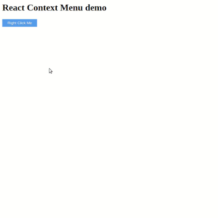

# React Mini Contextmenu

Minimal ContextMenu in React with accessibility support. 

No External Dependiencies, pure react component. 

## Demo



## Table of contents

 - [Installation](##installation)
 - [Browser Support](##browser-support)
 - [Usage](##Usage)
 - [Changelog](##changelog)
 - [License](##license)
 
## Installation

Using npm

```
npm install --save react-mini-contextmenu
```

Using yarn

```
yarn add react-mini-contextmenu
```
## Browser Support
- IE 11 and Edge >= 12
- FireFox >= 38
- Chrome >= 47
- Opera >= 34
- Safari >= 8

## Usage

```js
import Contextmenu from "react-mini-contextmenu"
```

```html
function Home() {

    const [event, setEvent] = useState(false);

    const buttonClicked = (e: MouseEvent | any) => {
      e.preventDefault();
      e.persist();
      // set Mouse event 
      setEvent(e);
    }

    const doAction = () => {
      alert('Done action, closing context menu');
      setEvent(false);
    }
  return (
    <div >
      <h1>Context Menu demo</h1>
      	  <ContextMenu event={event}> 
          <ul style={listStyle} className="menu-options">
            <li style={listItem} onClick={doAction} className="menu-option">Back</li>
            <li style={listItem} onClick={doAction} className="menu-option">Reload</li>
            <li style={listItem} onClick={doAction} className="menu-option">Save</li>
            <li style={listItem} className="menu-option">Save As</li>
          </ul>
	  </ContextMenu>
    <button onContextMenu={buttonClicked}>Right Click Me</button>
    </div>
  );
}
```

## Changelog

For Changelog, see [releases]()

## License

[MIT](./LICENSE.md). Copyright(c)